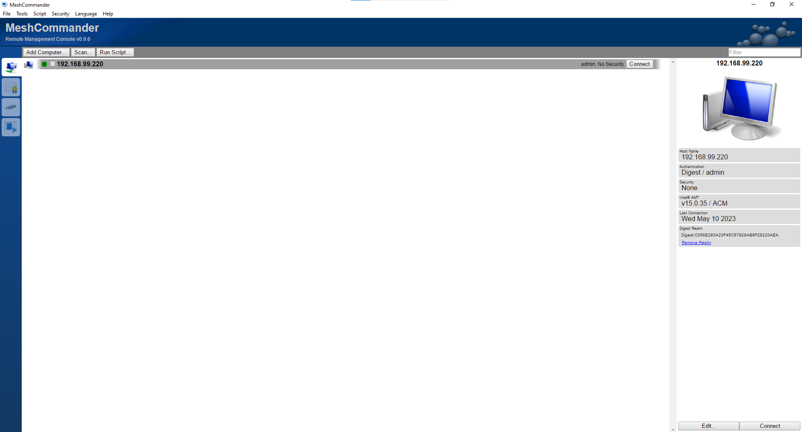
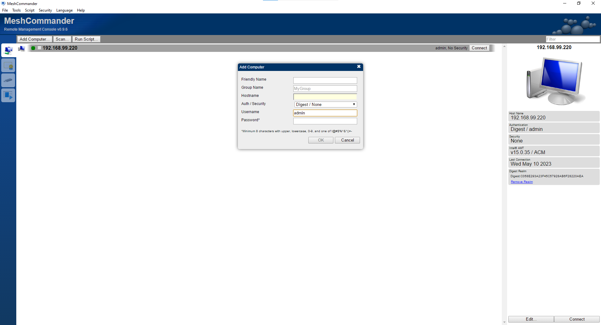
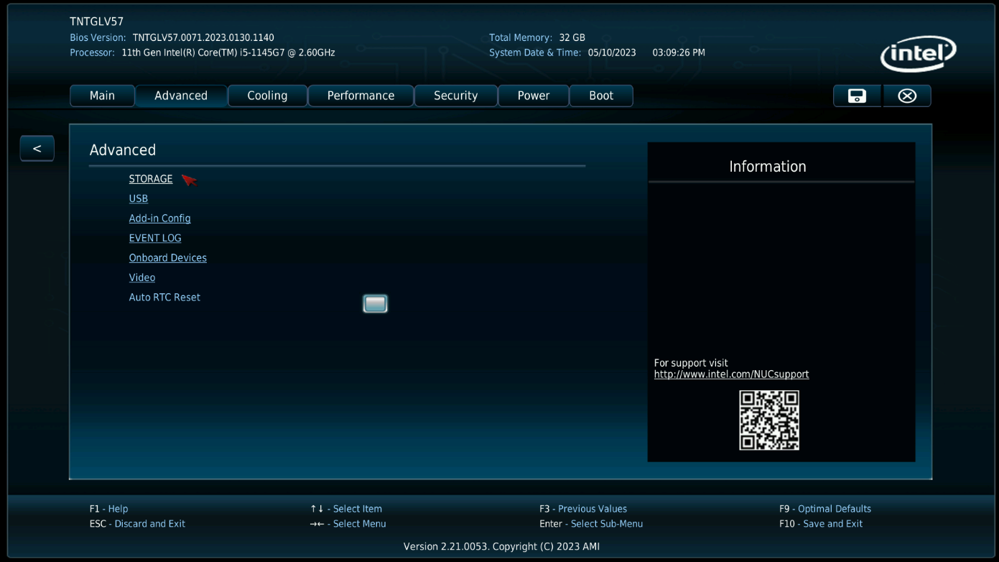
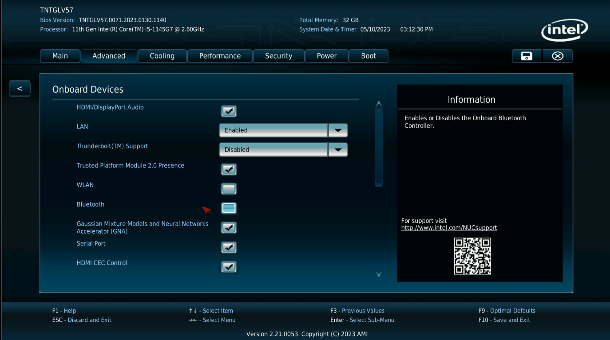
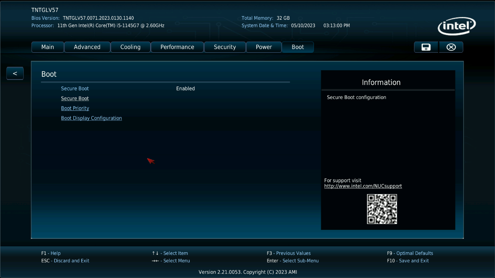
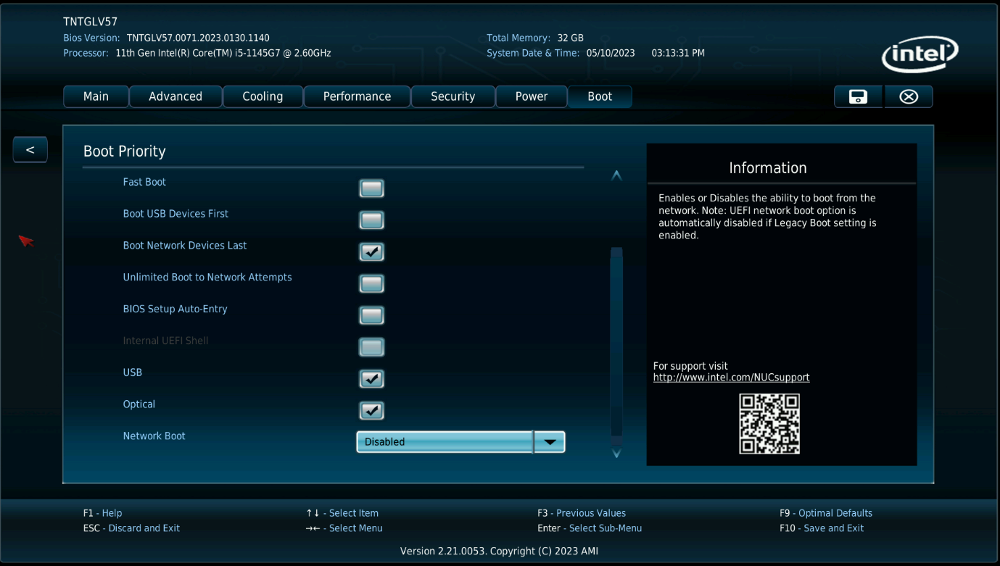
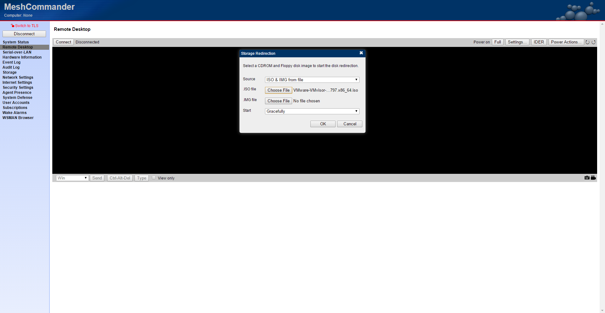
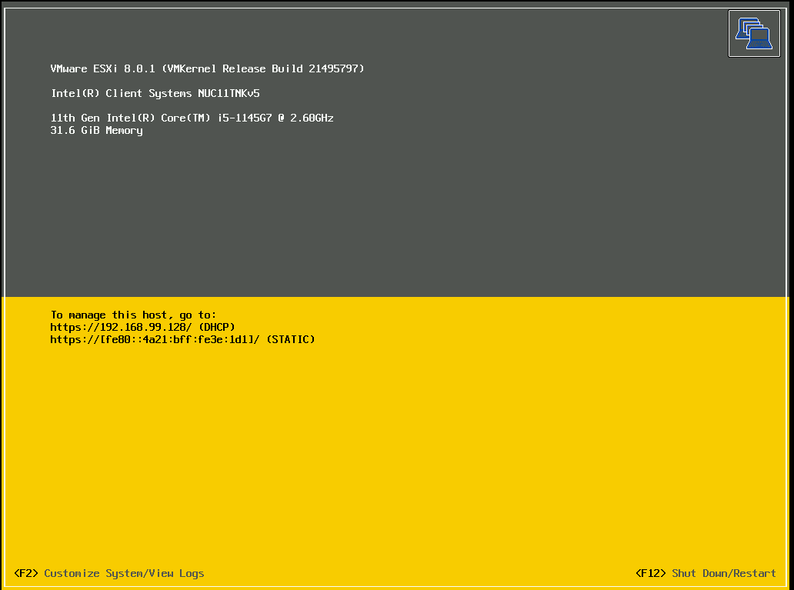

# Installation d'un NUC partie distante

## Le logiciel MeshCommander

Il faut installer le logiciel MeshCommander afin d'utiliser les fonctions du V-Pro.  
Il est téléchargeable à l'addresse suivante : [Mesh Commander](https://www.meshcommander.com/meshcommander)  
Il suffit de l'installer puis de le lancer.  
Pour ajouter un matériel compatible V-Pro, cliquer sur le bouton "add computer" puis remplir les informations, laisser le nom de groupe vide et l'utilisateur en "admin" puis valider.  
  

Cliquer sur le bouton connect sur le côté afin d'être sur l'interface V-Pro associée à la machine.  

## Configuration du BIOS via V-Pro

Afin de modifier le BIOS, on va utiliser la fonction V-Pro du NUC.  
Se rendre dans la section "Remote Desktop" de MeshCommander et cliquer sur "Connect" afin de récupérer la vue de l'écran distant.  
  

Cliquer sur le bouton "Power Action" puis choisir l'option "Reset to Bios" avant de valider.  

Lorsque l'interface de BIOS Intel s'affiche, appuyer sur la tuche F9 et valider afin de charger les réglages par défaut.
Dans la partie "Main" penser à changer la date et l'heure, attention la date se met au format **MM/JJ/AAAA**.  

Passer dans la partie "Advanced" puis dans "Storage" décocher l'option "M2 port 2".  
Dans la partie "Advanced" puis dans "USB" passer toutes les options à la valeur "disabled".  
Dans la partie "Advanced" puis dans "Onboard devices" passer la valeur "Thunderbolt Support à "disabled" et décocher en face des cases "WLAN" et "Bluetooth".  

Passer dans le menu "Boot" puis dans la section "Boot Priority" descendre tout en bas et mettre la valeur "Network Boot" à "Disabled".  

Quitter le BIOS en sauvegardant avec "F10" et valider les changements.  

## Installation de l'ESXi via V-Pro

Se rendre dans la section "Remote Desktop" de MeshCommander et cliquer sur "Connect" afin de récupérer la vue de l'écran distant.
Cliquer sur le bouton "IDER" et choisir un fichier ISO contenant l'ESXi et valider.
Cliquer sur le bouton "Power Action" puis choisir l'option "Reset to IDE-R CD-ROM" avant de valider.  

Dès le boot, appuyer sur la touche "Ctrl+O" afin d'ajouter la mention suivante " systemMediasize=small" (bien mettre un espace avant ce texte) puis valider.  

Suivre l'installation en validant avec les touches "entrée" et "F11".  

Garder le clavier avec la disposition "US-Default" et mettre en mot de passe "4Vfsiè_&"" ce qui vaudra un "$Vfsi7813" en AZERTY.

Finir l'installation et retirer l'ISO avec le bouton "Stop IDE-R Session" avant de valider le redémarrage de la machine avec la touche "Entrée".  

